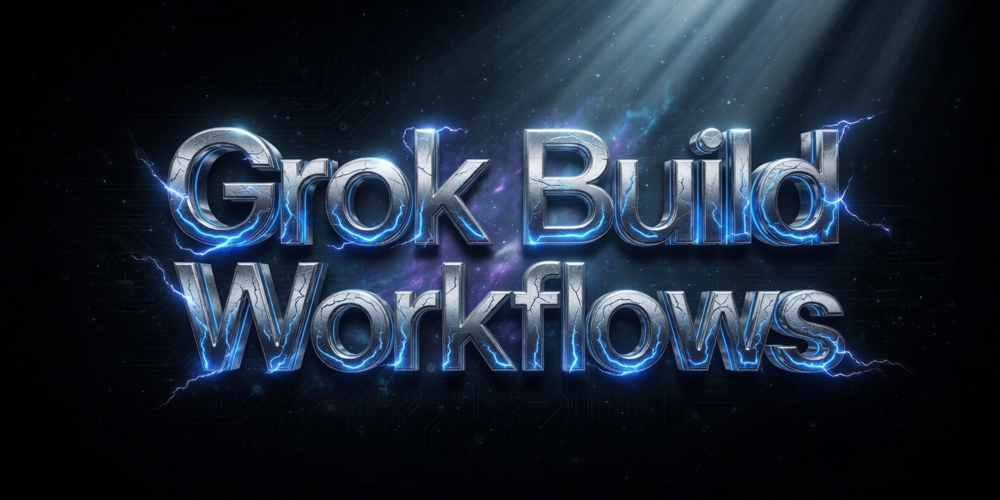

# Is The Missing Piece in AI Agent Tools?

> Grok Build can capture workflows so they can be reused & shared…

**Author:** Cobus Greyling
**Date:** Jun 01, 2026

---

Thanks for reading Cobus Greyling on LLMs, NLU, NLP, chatbots & voicebots! Subscribe for free to receive new posts and support my work.

> Here I cover how Grok Build turns valuable agentic work into durable, version-controlled, team-shareable commands & why workflow should not be lost the moment the session ends.

## Background

First, some background, a while back OpenAI released a study where they transformed documents into the most optimised and actionable workflows.

This stayed with me, because it is a offline implementation of LLMs to optimise and streamline work (workflows).

And the inference effort can be saved and re-used in a static fashion.

Also, a while back, SalesForce had very much the same approach where they turned unstructured conversational data into procedures or worflows.

Claude Opus 4.8 has workflows, but it is dynamic, ephemeral…it gets created and disappears…Grok Build allows you to save to workflows…

This creates a certain durability and repeatability which is often required. Get the LLM to optimise a process, save it, vet it, and use it over and over again.

## Breaking it down

Consider this, you spend 45 minutes with an agent doing something genuinely valuable, like

- A careful, multi-step refactoring with security review
- A full design, implementation, parallel review cycle
- Investigating a production incident, tracing through logs, code and metrics. Producing a clear root cause and fix plan.
- Or running three different implementation approaches in parallel and picking the best one after structured evaluation.

At the end, the result is good with sound reasoning and a good process.

> But the designed workflow ends, gets discarded.

So when a teammate needs to do the same thing, that entire workflow is gone.

Sure, someone might remember the broad strokes. More often, you (or someone else) just start from scratch again. The knowledge, the decision points, the specific sequence of checks and validations, all of it evaporates.

> Most agentic tools optimise for the individual "magic moment" in a chat.

They have almost nothing for turning that magic into something that can be:

- Reused reliably by the same person later
- Shared with teammates
- Version controlled
- Improved over time by the team
- Discovered when someone needs it
- The workflow dies with the session.

## The solution

To solve this properly, an agent system needs two capabilities working together:

1. A powerful enough execution model that you can do genuinely complex, high-quality work (parallel investigation, specialized review, iterative refinement, safe experimentation, etc.) without the process falling apart.

2. A good way to capture that entire workflow, not just the final output and turn it into something reusable and shareable.

Keep in mind, that this is the correct way to of work in my opinion.

In stead of you spending an exorbitant amount of time crafting a workflow / skill, you can save a workflow which worked and are proven.

## Grok Build has both

The harness gives you the power to do sophisticated work in a structured way.

The `/skillify` command is what makes that work durable and organisational.

This combination do complex things reliably, then immediately package the whole process, is the development I believe actually matters for teams.

The key command is `/skillify` (also available as `/create-skill`).

You use it in two situations:

### Right after finishing a valuable workflow

The system analyses what you actually did (the commands, the file operations, the decision points, the order of operations) and proposes a reusable skill.

### Trying it from scratch

When you want to describe a process that should exist, even if you haven't run it yet.

In both cases, it produces a proper `SKILL.md` file with:

- A clear `name` and `description` (the description controls when the skill auto-activates)
- Structured steps with success criteria
- Parameter extraction (so you don't hardcode "PR #1234" or "the user-service repo")
- Guidance on when to use it and what tools it needs

Once written, the skill appears as a slash command (`/your-skill-name`) and can be invoked by anyone who has access to it.

Here is a walkthrough of a simple example…

## Simple example

### Capturing a reliable investigation workflow

Say you regularly get paged for a certain class of production issue.

You have developed a solid mental checklist: look at recent deploys, check the three key dashboards, grep for specific error patterns in logs, look at the last known good state, etc.

Every time you do it, you do it slightly differently. Sometimes you forget a step. The knowledge lives only in your head.

### What you do

You deliberately run a clean session where you handle one such incident using your best process. You are explicit about each step.

At the end, instead of closing the session, you type:

```
/skillify incident investigation for payment-service latency spikes
```

The system sees the recent coherent workflow and enters from-session mode.

It walks you through a short interview:

- Suggested name: "investigate-payment-latency"
- Scope: Project (so it lives in the repo's ".grok/skills/")
- Refines the description so the skill knows when to offer itself

It then generates a complete skill. You review it, make a couple of tweaks and confirm.

### The Result

You now have `/investigate-payment-latenc` as a first-class command in the project.

```yaml
name: investigate-payment-latency
description: >
  Investigate sudden latency spikes or slow payment processing in the payment-service.
  Use when users report slow checkouts, high p99 latency on payment endpoints, or when
  latency alerts fire for the payment-service. Follows the team's standard investigation
  playbook for this class of incident.
when-to-use: >
  payment service latency, slow payments, payment-service p99 high, checkout is slow,
  payment latency spike, high latency on /pay or /checkout
allowed-tools: ["run_terminal_cmd", "read_file", "grep", "list_dir"]
argument-hint: "[optional time window, e.g. 'last 2 hours' or specific incident time]"
---

# Payment Service Latency Investigation

Investigate elevated latency in the payment-service following the team's proven process. The goal is to quickly identify whether the issue is in our code, a downstream dependency, infrastructure, or a recent change.

## Prerequisites

- You have access to the production metrics dashboards and logs for `payment-service`.
- You can run `kubectl`, `gh`, and our internal observability tools.

## Step 1: Establish the scope and timeline

**Success criteria:** You can state exactly when the latency increase began and whether it is fleet-wide or limited to specific regions/instances.

1. Ask the user (or check the alert) for the approximate start time of the issue.
2. Run the recent deployment check:
   ```bash
   kubectl get deployments -n production payment-service -o yaml | grep -E 'image:|lastUpdateTime'
   ```
3. Check the canary / rollout status if we are in the middle of a deployment.
4. Pull high-level metrics for the last 4–6 hours:
   - p99 latency on key endpoints (`/pay`, `/checkout`, `/process`)
   - Error rate
   - Request rate

Document the exact time the regression started.

## Step 2: Check for recent changes

**Success criteria:** All changes deployed in the last 4 hours (and any in-flight canaries) are listed with their risk level.

1. List deployments and config changes in the payment-service namespace in the last 4 hours.
2. Check related services that payment-service depends on (payment-gateway, fraud-service, user-service, redis, postgres).
3. Review the last merged PRs that touched `payment-service` or its direct dependencies.
4. Note any database migrations, feature flags, or config changes that went out recently.

If a change looks suspicious, note the commit SHA and author.

## Step 3: Analyze metrics and narrow the blast radius

**Success criteria:** You know if the latency is:
- Uniform across all instances
- Limited to a subset of pods / AZs
- Correlated with a specific downstream call
- Correlated with request attributes (user segment, payment method, amount, etc.)

Look at:
- Latency breakdown by downstream dependency (use the service mesh / tracing dashboards)
- Latency heatmaps by pod and availability zone
- Correlation with request attributes (payment method, currency, user tier)
- Any increase in queue depth or connection pool exhaustion

## Step 4: Deep dive into logs and traces

**Success criteria:** You have identified the slowest spans or the specific code path that is taking excessive time.

1. Sample 10–20 slow requests from the time window using distributed tracing.
2. Look for the following common patterns in logs:
   - Slow database queries (especially on `payments` or `transactions` tables)
   - Timeouts or retries against the payment gateway
   - Fraud service calls taking > 800ms
   - Redis connection pool exhaustion or slow commands
3. Use `grep` or the log search tool for error patterns that often accompany latency (connection refused, context deadline exceeded, etc.).

## Step 5: Check downstream dependencies health

**Success criteria:** You have ruled in or out each major downstream system.

Explicitly check the health and latency of:
- Payment gateway (external)
- Fraud detection service
- User profile / risk service
- Postgres (connection count, slow queries, locks)
- Redis (memory pressure, slow commands, connection count)
- Any other services called during payment flow

Document the p99 latency of each hop during the incident window.

## Step 6: Form a hypothesis and validate

**Success criteria:** You have a clear leading hypothesis with supporting evidence.

Common hypotheses for this service include:
- Recent deploy introduced a slow path
- Downstream dependency (especially fraud or gateway) degraded
- Database query regression or lock contention
- Connection pool exhaustion under current load
- Canary receiving disproportionate traffic

Test the hypothesis with additional queries or by looking at a specific pod / time slice.

## Step 7: Produce the investigation summary

Write a clear summary with the following structure:

```markdown
## Payment Service Latency Investigation — [Date/Time]

**Incident window:** ...
**Symptom:** p99 latency on /pay rose from ~180ms to ~1.8s starting at ...

### Timeline of Changes
- ...

### Key Findings
- ...

### Leading Hypothesis
...

### Evidence
- ...

### Recommended Next Actions
1. ...
2. ...
```

If you reach a point where you need a human decision (e.g. rollback a canary), clearly state the decision required and the risk of each option.

## Important Conventions

- Always check the canary status before assuming a problem is fleet-wide.
- Treat any increase in p99 above 800ms on payment endpoints as high priority.
- When in doubt, pull traces for the slowest 1% of requests in the window — they usually reveal the culprit.
- Document both what you checked *and* what you ruled out.

This process has repeatedly helped the team find the root cause of payment latency issues within 20–40 minutes.
```

## Deeper point

Most agent tools are designed around the individual conversation as the unit of work.

That model is fundamentally incompatible with organisational knowledge management.

If your best processes only exist inside private, ephemeral chat sessions, you will never build durable advantage.

> The combination of a powerful execution harness + an explicit capture mechanism (`/skillify`) changes the unit of work from a chat session to a reusable, improvable, shareable workflow.

That is the shift that actually matters for teams and companies.

## Practical advice

Be deliberate about capture moments.

After any workflow that felt high-quality or painful to figure out, run `/skillify` immediately while the context is still fresh.

Default to project scope. When in doubt, save the skill in the repo so the team benefits. You can always move it later.

Treat skills like code. They should be reviewed, discussed and improved. A good captured skill is a living artifact.

Start with your actual painful workflows. Don't invent abstract skills. Capture the things you keep having to re-explain or re-do.

Use the interview. The description you write during `/skillify` is the most important part.

It determines when the skill activates automatically. Spend real thought on it.

## Finally

The agentic tools that will win inside organisations are not the ones that let teams **accumulate** capability.

Where doing good work once, makes it easier and more consistent for everyone to do good work going forward.

Grok Build's approach to workflow capture is the first thing I've seen that actually operationalises this at the level of real, complex agentic processes.

The workflows no longer have to die with the session. They can become part of the organisation's permanent toolkit.

---

**Chief Evangelist @ [Kore.ai](https://kore.ai)** | I'm passionate about exploring the intersection of AI and language. From Language Models, AI Agents to Agentic Applications, Development Frameworks & Data-Centric Productivity Tools, I share insights and ideas on how these technologies are shaping the future.

---

*Originally published at [cobusgreyling.substack.com](https://cobusgreyling.substack.com/p/is-the-missing-piece-in-ai-agent).*
